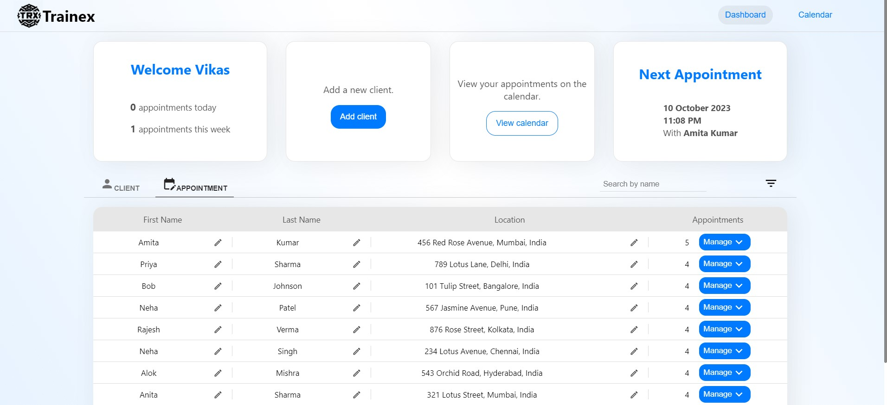

# Trainex App

## Technology Used

This application is built with ReactJs and its libraries.

## Requirements

- **npm (Node Package Manager):** You need to have Node.js installed, which includes npm. Node.js is a JavaScript runtime that allows you to execute JavaScript code outside the browser. npm is the package manager for Node.js and is used to manage and install packages, including React and its dependencies.
  - Download and install Node.js from the official website: [Node.js Official Website](https://nodejs.org/). Make sure to download the recommended version.

## How to Run the Code

Follow these steps to run the code:

1. Clone the repository to your local system.
2. Open the repository in your terminal.
3. Run `npm install` or `npm i` to install all the required dependencies.
4. After that, run `npm start`.
5. The application will run on the default port 3000.

## About Packages

The main packages and libraries used in this project are:

- `react-redux` and `@reduxjs/toolkit`: For state management
- `react-router-dom`: For routing
- `@mui/icons-material`, `@mui/material`, `@emotion/styled`, `@emotion/react`: For icons and styling
- `formik` and `yup`: For client form validation

## About the Application

This application consists of two pages separated using routes:

1. **Dashboard:** This page contains all the required functionality.
2. **Calendar:** This section contains the optional bonus calendar feature.

### Dashboard

The Dashboard has two sections:

- **Top Section:** This section contains 4 cards.

  - The first card displays data like the appointment count (today and weekly). Weekly count represents the count of appointments for the current week (from Sunday to Saturday). This section also contains information about the next appointment.
  - The second card ("Add Client") is not implemented yet but will open the form for adding new clients when implemented.
  - The third card ("View Calendar") allows you to open the calendar.
  - The fourth card contains information about the next appointment.

- **Main Section:** This section contains two tables: one for displaying client details and the other for appointment details. It also contains elements for switching tables, filtering data based on dates and gender, and a search functionality to search for users by name. The appointment table has implementations of all the required functionality mentioned in the assignment, including editable fields with buttons for updating data. Changes made to the appointment table will also apply to the client table.

**Notes:**

- After a filter is applied, the filter button color changes to blue to indicate that a filter is active. The filter can be reset using the button in the filter menu, which will remove the filter and display all the data.

- There is some validation and rules for updating data and appointment creation:
  1. First Name and Last Name: Must be 2-15 characters.
  2. Address: Must be 5-50 characters.
  3. Appointment Date and Time: Cannot be a time that has already passed. When creating an appointment, the date and time must not overlap with existing data. Error messages will be shown if any of these rules are violated.

|
|

### Calendar

This page contains the implementation of the bonus feature, a calendar that can be used by trainers to conveniently view their appointments. You can access it using the navigation "Calendar" button and the "View Calendar" button.

**Note:**

- There is an info card that displays the names of clients and appointment times for a particular date. This card becomes visible when you click on the text indicating the total appointments for the day.

|

## Things to Consider

I am planning to continue working on this app and adding more features like adding more clients and managing them separately. One important thing to note is that there is currently no method used for persisting data, such as local storage or a backend. The application uses Redux for state management, which stores appointment and client data in the global state. This way, the data will persist as long as the user is using the application, but it won't survive a page refresh or a new session.

## Links

- **GitHub Repository:** [Trainex GitHub Repository](https://github.com/Vikas10102001/Trainex)
- **Live Demo:** [Trainex Live Demo](https://trainex.vercel.app/)
